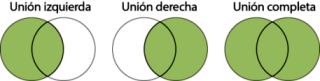

```{r setup, include=FALSE}
knitr::opts_chunk$set(echo = TRUE,
                      message = FALSE,
#                    fig.width=3, 
#                    fig.height=3,
                    fig.align = "center", 
                    fig.pos="h")
#library("png")
#library("jpeg")
```


<!--# SQL – Unión de tablas-->

# Introducción

Hasta el momento se han ralizado consultas **SQL** operando una sola tabla de datos, sin embargo, muchas veces es necesario obtener una consulta cuyas filas tengan datos provenientes de tablas independientes, por ejemplo, obtener las facturas y que en la misma fila de factura aparezca el nombre y dirección del cliente. En este material se estudiarán este tipo de consultas basadas en la combinación o unión (JOIN) de tablas. La unión de tablas consiste en obtener a partir de dos tablas cualesquiera una nueva tabla fusionando las filas de una con las filas de la otra.

<!--Cuando se especifican varias tablas de consulta en la cláusula *FROM*, **SQL** las procesa para formar una salida. El resultado contiene datos de cada tabla fuente. A estas consultas se las conoce como *combinaciones*.-->

Conceptualmente, cuando se especifican dos conjuntos de datos, **SQL** hace coincidir cada fila del primero con todas las filas del segundo para producir un resultado conocido como *producto cartesiano*. El *producto cartesiano* de grandes conjuntos de datos puede ser muy grande, por lo cual, este tipo de operación no es la que se utiliza más a menudo, lo más apropiado sería obtener una salida que sea un subconjuntos de datos declarando el tipo de combinación. 

# Combinación de tablas

## Combinación interna

La *Combinación interna* devuelve una salida con todas las filas de la tabla de la isquierda que tienen una o más filas coincidentes en la tabla de la derecha. Busca coincidencias entre las dos tablas, en función a una columna que tienen en común. De tal modo que en el resultado sólo se mostrará la intersección. 


```{r, echo=FALSE, out.width=85}
#```{r, echo=FALSE, fig.cap="Combinación interna", out.width=85}
knitr::include_graphics("Image/union_interna.png")
```

## Combinaciones externas

Las **Combinaciones externas** son combinaciones internas que se incrementan con las filas que no coinciden con ninguna fila de la otra tabla en la combinación. Hay tres tipos de combinaciones externas: izquierda, derecha y completa. La tarea central es unir tablas para obtener un detalle sobre la consulta de tablas individuales.

```{r, echo=FALSE}
#```{r, echo=FALSE, fig.cap="Combinaciones externas"}

```

<!--

-->

### Combinación izquierda

Comunmente llamada *LEFT JOIN* en **SQL** (*Unión izquierda*), es un tipo de *combinación externa* en la que la salida resultante incluye todas las observaciones de la tabla izquierda independientemente de que se encuentre una coincidencia en la tabla especificada a la derecha. Esta combinación se representa en el siguiente diagrama.

```{r, echo=FALSE, out.width=85}
#```{r, echo=FALSE, fig.cap='Combinación izquierda', out.width=85}
knitr::include_graphics("Image/union_izq.png")
```

<!--

-->

### Combinación derecha

Se la conoce como *RIGHT JOIN* en **SQL** (*unión derecha*). Es idéntica a la *unión izquierda*, excepto que el resultados incluye todas las observaciones de la tabla derecha, si se encuentra o no una coincidencia para ellas en la tabla de la izquierda. Una combinación derecha entre dos tablas se puede representar gráficamente como se muestra en el siguiente diagrama.

```{r, echo=FALSE, out.width=85}
#```{r, echo=FALSE, fig.cap='Combinación derecha', out.width=85}
knitr::include_graphics("Image/union_der.png")
```

<!--

-->

### Combinacion completa

Esta combinación es conocida como *Full (outer) Join* en **SQL** (*Unión completa*). En este tipo de unión la consulta resultante incluye todas las observaciones de ambas tablas para las cuales haya coincidencia, más las filas de cada tabla que no coinciden con ninguna fila en la otra tabla. La representación visual de la unión completa se muestra en el siguiente diagrama.

```{r, echo=FALSE, out.width=85}
#```{r, echo=FALSE, fig.cap='Combinación completa', out.width=85}
knitr::include_graphics("Image/union_comp.png")
```

<!--

-->

## Otras variantes

### Exclución interna izquierda

Esta consulta devolverá todos los registros de la tabla de la izquierda que no coincidancon ningún registro de la tabla de la derecha. La representación visual de esta unión semuestra en el siguiente diagrama:

```{r, echo=FALSE, out.width=85}
#```{r, echo=FALSE, fig.cap='Exclución interna izquierda', out.width=85}
knitr::include_graphics("Image/exc_izq2.jpg")
```

### Exclución interna derecha

Esta consulta devolverá todos los registros de la tabla de la derecha que no coincidan conningún registro de la tabla de la izquierda. La representación visual de esta unión se muestra en el siguiente diagrama:

```{r, echo=FALSE, out.width=85}
#```{r, echo=FALSE, fig.cap='Exclución interna derecha', out.width=85}
knitr::include_graphics("Image/exc_der2.jpg")
```

### Exclución interna exterior

Esta consulta devolverá todos los registros de la tabla de la izquierda y todos los registros de la tabla de la derecha que no coincidan. La representación visual de esta unión se muestra en el siguiente diagrama:

```{r, echo=FALSE, out.width=85}
#```{r, echo=FALSE, fig.cap='Exclución interna exterior', out.width=85}
knitr::include_graphics("Image/exc_ext2.jpg")
```


## Unión interna y externa de dataframe en R

### Función *merge()*

Se puede combinar dos dataframe (conjunto de datos) en **R** usando la función *merge()*. Como requisito, los conjuntos de datos deben tener los mismos nombres en las columna que se utilizan para realizar la unión. La función *merge()* en **R** es similar a la operación de unión de tablas con **SQL**. Los diferentes argumentos para *merge()* permiten realizar combinaciones internas, así como las combinaciones externas izquierda, derecha y completa. <!--Se puede realizar Unión (Join) en R usando la Función *merge()*.-->

#### Argumentos 

<!-- de la función *merge()* -->

Los argumentos de la función *merge()* son:

* **"x"** : dataframe_1.
	
* **"y"** : dataframe_2.

* **"by"** , **"x"** , **"by.y"** : los nombres de las columnas que son comunes a **"x"**  e **"y"** . El valor predeterminado es usar las columnas con nombres comunes entre los dos conjuntos de datos.

* **"all, all.x, all.y"** : valores lógicos que especifican el tipo de unión. El valor predeterminado es *"all=FALSE"*  (lo que significa que solo se devuelven las filas coincidentes).

**Definición de argmentos para los diferentes tipos de unión:**
	
* ***Unión interna*** : para mantener solo las filas que coinciden con los conjuntos de datos, especifique el argumento *"all=FALSE"*.
	
* ***Unión completa***: para mantener todas las filas de ambos  conjuntos de datos, se especifica *"all=TRUE"*.
	
* ***Unión izquierda***: para incluir todas las filas del  conjunto de datos de la izquierda **"x"** y solo aquellas filas del de la derecha **"y"** que coincidan, se especifica *"all.x=TRUE"*.
	
* ***Unión derecha***: para incluir todas las filas del conjunto de datos de la derecha **"y"** y solo las filas del de la izquierda **"x"** que coinciden, se especifica *"all.y=TRUE"* .

```{r, echo=FALSE, fig.cap="Argumentos función merge", fig.align='center'} 
knitr::include_graphics("Image/JOIN_R.jpg")
```

<!--

-->

### Ejemplos prácticos.

Primero se definien dos conjuntos de datos que serán la base para los ejemplos posteriores. Por un lado, la tabla *Empleados* que almacena una lista de empleados y el id del departamento al que pertenecen:

**Empleados**

```{r, echo=F, eval= TRUE }
df1 <- read.csv("Datos/empleados.csv")
```


```{r, echo=F, eval= TRUE }
df1
```

Y por otro lado, la tabla *Departamentos* con la lista de departamentos que existen en la empresa.

**Departamentos**

```{r, echo=F, eval=TRUE}
df2 <- read.csv("Datos/departamentos.csv")
```


```{r, echo=F, eval=TRUE}
df2
```

**Unión interna**

En el ejemplo, se quiere listar los empleados e indicar el nombre del departamento al que pertenecen, se reliza lo siguiente:


```{r, echo=TRUE, eval=TRUE}
df <- merge(x = df1, y = df2, by = "departamentoID")
```

Con este comando el resultado es:

```{r, echo= FALSE, eval=TRUE }
df
```

Y apartir del resultado se puede observar que:

+ El empleado "Williams" no aparece en los resultados, ya que no pertenece a ningún departamento existente.

+ También, hay que tener en cuenta que, en el listado resultante se ven 3 columnas, las 2 primeras corresponden a la tabla Empleados y la última a Departamentos.

**Unión completa** 

En este ejemplo se encarga de mostrar todas las filas de ambas tablas, sin importar que noexistan coincidencias (usará *NA* como un valor por defecto para dichos casos).


```{r, echo=TRUE, eval=TRUE}
df <- merge(x = df1, y = df2, by = "departamentoID", all = TRUE)
```

***

Como resultado muestra la siguiente lista:

```{r, echo= FALSE, eval=TRUE }
df
```

Se puede observar al empleado "Williams" a pesar de que no está asignado a ningún departamento, y se muestra el departamento de "Marketing" sin que tenga algun empleado trabajando en él.


**Unión izquierda** 

Para este jemplo, la tabla *Empleados* es la primera tabla que aparece en la consulta (df1), por lo tanto es la tabla izquierda, y todas sus filas se mostrarán en los resultados.

La tabla *Departamentos* es la tabla de la derecha (df2) y si se encuentran coincidencias se mostrarán los valores correspondientes, pero sino, aparecerá NA en los resultados.


```{r, echo=TRUE, eval=TRUE}
df <- merge(x = df1, y = df2, by = "departamentoID", all.x = TRUE)
```

El resultado es:

```{r, echo= FALSE, eval=TRUE }
df
```


**Unión derecha**

En el siguiente ejemplo, la tabla *Departamentos* es la segunda tabla que aparece en la consulta (df2), es la tabla de la derecha y se verán todas sus filas.

La tabla *Empleados* es la tabla de la izquierda (df1) y si se encuentran coincidencias se mostrarán los valores correspondientes, pero sino, aparecerá NA en los resultados.


```{r, echo=TRUE, eval=TRUE}
df <- merge(x = df1, y = df2, by = "departamentoID", all.y = TRUE)
```

Entonces el resultado mostrará todos los departamentos al menos una vez. Y si no hay ningún empleado trabajando en un departamento determinado, se mostrará NA. Pero el departamento igual aparecerá.

```{r, echo= FALSE, eval=TRUE }
df
```

***

**Combinación cruzada**

También conocida como combinación cartesiana, da como resultado que cada fila de una tabla se una a cada fila de otra tabla.

```{r, echo=TRUE, eval=TRUE}
df<-merge(x = df1, y = df2, by = NULL)
```

El conjunto de datos resultante será:

```{r, echo= FALSE, eval=TRUE }
head(df, n=15)
```

*****

*Nota: Se puede realizar una selección de variables utilizando la función __sqldf()__ una vez que se ha obtenido el conjunto de datos como resultado de la union de dos o mas tablas.*

*****
<!--
## Unir más de dos data frames en R

Por último, cabe mencionar que puedes unir iterativamente data frames en **R**, concatenando la función *merge*. Considera, por ejemplo, los siguientes conjutos de datos:

```{r echo=FALSE}
x <- data.frame(id = 1:4, año = 1995:1998)

y <- data.frame(id = c(4, 1, 3, 2),
                año = c(1998, 1995, 1997, 1996),
                edad = c(22, 25, 23, 24))

z <- data.frame(id = c(1, 2, 3),
                año = 1995:1997,
                salario = c(1000, 1200, 1599))
```


```{r echo=T}
x
y
z

```

Puede unir los tres data frames fusionando primero dos y uniendo la salida con el tercer conjunto de datos.

```{r}
merge(x, merge(y, z))
```

Ten en cuenta que puedes especificar los argumentos que prefieras para cada combinación y que puedes concatenar tantos merge como necesites.

```{r}
merge(x, merge(y, z, all = TRUE), all = TRUE)
```


Una alternativa más limpia es usar la función *Reduce*, de manera que en lugar de concatenar las funciones *merge*, se pasan los data frames en una lista. Sin embargo, en este caso tendrás que establecer los mismos argumentos para todas las uniones.

```{r}
Reduce(function(x, y) merge(x, y), list(x, y, z))
```

-->

# Fusión de conjuntos de datos (interna y externa) en SAS

<!--## PROC SQL-->

**PROC SQL** implementa el lenguaje de consulta estándar y permite al usuario la unión de *dataset* mediante consultas de combinación.

Como se ha descripto en el material "*Lenguaje de Consulta Estructurado en SAS y R*", en **PROC SQL** la cláusula *FROM* se utiliza en una expresión de consulta para especificar el/los conjunto(s) de datos fuente, y que se combinan para producir el resultado de la unión.

Además de los diversos tipos de combinaciones (internas y externas) que se describen, los ejemplos que se incluyen muestran la igualdad entre los valores de columna provenientes de las tablas que se están uniendo; comparación entre valores calculados; etc. La cláusula *WHERE* o la cláusula *ON* contienen las condiciones bajo las cuales algunas filas son guardadas o eliminadas en la tabla de resultados. *WHERE* se usa para seleccionar filas de uniones internas. *ON* se utiliza para seleccionar filas de uniones internas o externas.

**Ejemplos**

**Unión interna**

```{r, echo=TRUE, eval=FALSE}
proc sql;
   title 'Oil Production/Reserves of Countries';
   select p.country, barrelsperday 'Production', 
          barrels 'Reserves'
      from oilprod p, oilrsrvs r
      where p.country = r.country
      order by barrelsperday desc;
quit;
```

**Unión externa izquierda**


```{r, echo=TRUE, eval=FALSE}
proc sql;
   title 'Coordinates of Capital Cities';
   select Capital format=$20., 
          Name 'Country' format=$20., 
          Latitude, Longitude
      from countries a left join 
           worldcitycoords b
           on a.Capital = b.City and
              a.Name = b.Country
      order by Capital;
quit;
```

**Unión externa derecha**

```{r, echo=TRUE, eval=FALSE}
proc sql;
   title 'Populations of Capitals Only';
   select City format=$20., 
          Country 'Country' format=$20., 
          Population
      from countries right join 
           worldcitycoords 
           on Capital = City and
              Name = Country
      order by City;
quit;


```

**Unión externa completa**

```{r, echo=TRUE, eval=FALSE}
proc sql;   
   title 'Populations/Coordinates of World Cities';
   select City '#City#(WORLDCITYCOORDS)' format=$20.,
          Capital '#Capital#(COUNTRIES)' format=$20.,
          Population, Latitude, Longitude
      from countries full join 
           worldcitycoords
           on Capital = City and
              Name = Country; 
quit;
```

Borrar los títulos

```{r, echo=TRUE, eval=FALSE}
title;
```
