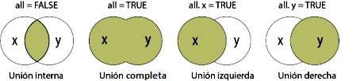

```{r setup, include=FALSE}
knitr::opts_chunk$set(echo = TRUE,
                      message = FALSE,
                    fig.width=3, 
                    fig.height=3,
                    fig.align = "center", 
                    fig.pos="hp")
library("png")
library("jpeg")
```


<!--# SQL – Unión de tablas-->

## Introducción

Las formas, que se ha vistos, de ralizar consultas con SQL, es utilizando  una sola tabla.
<!--Se han visto formas de consultar con SQL utilizando  una sola tabla.--> Sin embargo, a menudo es necesario obtener datos de tablas independientes. Cuando especifican varias *tablas* de consulta en la cláusula FROM, SQL las procesa para formar un conjunto de datos. El *tablas* resultante contiene datos de cada *tablas* fuente. Estas consultas se conocen como *combinaciones*.

Conceptualmente, cuando se especifican dos conjuntos de datos, SQL hace coincidir cada fila del primero <!--*dataframe*--> con todas las filas del segundo para producir un conjunto de datos interno o intermedio conocido como el *producto cartesiano*. El producto cartesiano de grandes conjuntos de datos puede ser enorme, pero normalmente se obtienen subconjuntos de datos declarando el tipo de combinación. Hay dos tipos de combinaciones:

* **Combinación interna**: devuelve una tabla cuyas filas son todas las filas de la tabla de la isquierda que tienen una o más filas coincidentes en la tabla de la derecha. Busca coincidencias entre las dos tablas, en función a una columna que tienen en común. De tal modo que sólo la intersección se mostrará en los resultados. 

<!--Esta consulta devolverá todos los registros de la tabla de la izquierda que tengan un registro coincidente en la tabla de la derecha.-->


```{r, echo=FALSE, fig.cap="Combinación interna", out.width=85}
knitr::include_graphics("Image/union_interna.png")
```

<!--

-->


* **Combinaciones externas** son combinaciones internas que se aumentan con filas que no coinciden con ninguna fila de la otra tabla en la combinación. Hay tres tipos de combinaciones externas: izquierda, derecha y completa.

```{r, echo=FALSE, fig.cap="Combinaciones externas"}
knitr::include_graphics("Image/union_idc.png")
```

<!--

-->

La tarea central es unir tablas para obtener un detalle sobre la consulta de tablas individuales.

**Unión izquierda** 

Es un tipo de *combinación externa* en la que la tabla de resultados incluye todas las observaciones de la tabla izquierda independientemente de que se encuentre una coincidencia en la tabla especificada a la derecha. 

<!--Esta consulta devolverá todos los registros de la tabla de la izquierda independientemente de si alguno de esos registros tiene una coincidencia en la tabla de la derecha. También devolverá cualquier registro coincidente de la tabla de la derecha.-->

El siguiente diagrama representa Una combinación izquierda entre dos tablas.

```{r, echo=FALSE, fig.cap='Combinación externa izquierda', out.width=85}
knitr::include_graphics("Image/union_izq.png")
```

<!--

-->

**Unión derecha**

Es idéntica a la *unión izquierda*, excepto que la tabla de resultados incluye todas las observaciones de la tabla derecha, si se encuentra o no una coincidencia para ellas en la tabla de la izquierda. 

<!--Esta consulta devolverá todos los registros de la tabla de la derecha independientementede si alguno de esos registros tiene una coincidencia en la tabla de la izquierda. También devolverá cualquier registro coincidente de la tabla de la izquierda.-->

Una combinación derecha entre dos tablas se puede representar gráficamente como se muestra en el siguiente diagrama.

```{r, echo=FALSE, fig.cap='Combinación externa derecha', out.width=85}
knitr::include_graphics("Image/union_der.png")
```

<!--

-->


**Unión completa**

En este tipo de unión la tabla resultante incluye todas las observaciones de ambas tablas para las cuales haya coincidencia <!-- la expresión SQL es verdadera-->, más las filas de cada tabla que no coinciden con ninguna fila en la otra tabla.

<!--Esta consulta devolverá todos los registros de ambas tablas, uniendo los registros de la tabla de la izquierda que coincidan con los registros de la tabla de la derecha.-->

La representación visual de la unión externa completa se muestra en el siguiente diagrama.

```{r, echo=FALSE, fig.cap='Combinación externa completa', out.width=85}
knitr::include_graphics("Image/union_comp.png")
```


<!--

-->


### Otras variantes

**Exclución interna izquierda **

Esta consulta devolverá todos los registros de la tabla de la izquierda que no coincidancon ningún registro de la tabla de la derecha. La representación visual de esta unión semuestra en el siguiente diagrama:

```{r, echo=FALSE, fig.cap='Exclución interna izquierda', out.width=85}
knitr::include_graphics("Image/exc_izq2.jpg")
```


**Exclución interna derecha**

Esta consulta devolverá todos los registros de la tabla de la derecha que no coincidan conningún registro de la tabla de la izquierda. La representación visual de esta unión se muestra en el siguiente diagrama:

```{r, echo=FALSE, fig.cap='Exclución interna derecha', out.width=85}

```

**Exclución interna exterior**

Esta consulta devolverá todos los registros de la tabla de la izquierda y todos los registros de la tabla de la derecha que no coincidan. La representación visual de esta unión se muestra en el siguiente diagrama:

```{r, echo=FALSE, fig.cap='Exclución interna exterior', out.width=85}

```


# Fusión de conjuntos de datos (interna y externa) en R

Se puede combinar dos conjuntos de datos en **R** usando la función *merge()*. Como requiseto, los conjuntos de datos deben tener los mismos nombres en las columna que se utilizan para realizar la unión. La función *merge()* en **R** es similar a la operación de unión de tablas en base de datos con SQL. Los diferentes argumentos para *merge()* permiten realizar combinaciones internas, así como combinaciones externas izquierda, derecha y completa. <!--Se puede realizar Unión (Join) en R usando la Función *merge()*.-->

Los argumentos de la función *merge()* son:

* **"x"** : conjunto de datos 1.
	
* **"y"** : conjunto de datos 2.

* **"by"** , **"x"** , **"by.y"** : los nombres de las columnas que son comunes a **"x"**  e **"y"** . El valor predeterminado es usar las columnas con nombres comunes entre los dos conjuntos de datos.

* **"all,all.x,all.y"** : valores lógicos que especifican el tipo de fusión. El valor predeterminado es "all=FALSE"  (lo que significa que solo se devuelven las filas coincidentes).

## Definición de argmentos para los diferentes tipos de fusión:
	
* ***Unión interna*** : para mantener solo las filas que coinciden con los conjuntos de datos, especifique el argumento *"all=FALSE"*.
	
* ***Unión completa***: para mantener todas las filas de ambos  conjuntos de datos, se especifica *"all=TRUE"*.
	
* ***Unión izquierda***: para incluir todas las filas del  conjunto de datos de la izquierda **"x"** y solo aquellas filas del de la derecha **"y"** que coincidan, se especifica *"all.x=TRUE"*.
	
* ***Unión derecha***: para incluir todas las filas del conjunto de datos de la derecha **"y"** y solo las filas del de la izquierda **"x"** que coinciden, se especifica *"all.y=TRUE"* .

```{r, echo=FALSE} 

```
<!--

-->

### Ejemplos prácticos.

Primero se definien dos conjuntos de datos que serán la base para los ejemplos posteriores. Por un lado, la tabla *Empleados* que almacena una lista de empleados y el id del departamento al que pertenecen:

**Empleados**

```{r, echo=F, eval= TRUE }
df1 <- read.csv("Datos/empleados.csv")
```


```{r, echo=F, eval= TRUE }
df1
```

Y por otro lado, la tabla *Departamentos* con la lista de departamentos que existen en la empresa.

**Departamentos**

```{r, echo=F, eval=TRUE}
df2 <- read.csv("Datos/departamentos.csv")
```


```{r, echo=F, eval=TRUE}
df2
```

**Unión interna**

En el ejemplo, se quiere listar los empleados e indicar el nombre del departamento al que pertenecen, se reliza lo siguiente:

<!--devuelve solo las filas en las que la tabla izquierda tiene claves coincidentes en la tabla derecha.-->

```{r, echo=TRUE, eval=TRUE}
df <- merge(x = df1, y = df2, by = "departamentoID")
```

Con este comando el resultado es:

```{r, echo= FALSE, eval=TRUE }
df
```

Y apartir del resultado se puede observar que:

El empleado "Williams" no aparece en los resultados, ya que no pertenece a ningún departamento existente.

También hay que tener en cuenta que, en el listado resultante se ven 3 columnas, las 2 primeras corresponden a la tabla Empleados y la última a Departamentos.

**Unión completa** 

En este ejemplo se encarga de mostrar todas las filas de ambas tablas, sin importar que noexistan coincidencias (usará *NA* como un valor por defecto para dichos casos).

<!--devuelve todas las filas de ambas tablas, registros de unión de la izquierda que tienen claves coincidentes en la tabla derecha.-->

```{r, echo=TRUE, eval=TRUE}
df <- merge(x = df1, y = df2, by = "departamentoID", all = TRUE)
```

Como resultado muestra la siguiente lista:

```{r, echo= FALSE, eval=TRUE }
df
```

Se puede observar al empleado "Williams" a pesar de que no está asignado a ningún departamento, y se muestra el departamento de "Marketing" sin que tenga algun empleado trabajando en él.


**Unión izquierda** 

Para este jemplo, la tabla *Empleados* es la primera tabla que aparece en la consulta (df1), por lo tanto es la tabla izquierda, y todas sus filas se mostrarán en los resultados.

La tabla *Departamentos* es la tabla de la derecha (df2) y si se encuentran coincidencias se mostrarán los valores correspondientes, pero sino, aparecerá NA en los resultados.


<!--devuelve todas las filas de la tabla izquierda y cualquier fila con teclas coincidentes de la tabla derecha.-->

```{r, echo=TRUE, eval=TRUE}
df <- merge(x = df1, y = df2, by = "departamentoID", all.x = TRUE)
```

El resultado es:

```{r, echo= FALSE, eval=TRUE }
df
```


**Unión derecha**

Si usamos la siguiente consulta, se muestran todas las filas de la tabla de la derecha. La tabla de la izquierda es *Empleados*, mientras que *Departamentos* es la tabla de la derecha.

<!--: devuelve todas las filas de la tabla derecha y cualquier fila coincidentes de la tabla izquierda. Si no existe ninguna coincidencia para alguna de las filas de la tabla de la izquierda, de igual forma todos los resultados de la primera tabla se muestran.-->


```{r, echo=TRUE, eval=TRUE}
df <- merge(x = df1, y = df2, by = "departamentoID", all.y = TRUE)
```

Entonces el resultado mostrará todos los departamentos al menos una vez. Y si no hay ningún empleado trabajando en un departamento determinado, se mostrará NA. Pero el departamento igual aparecerá.

```{r, echo= FALSE, eval=TRUE }
df
```


**Combinación cruzada**: una combinación cruzada, también conocida como combinación cartesiana, da como resultado que cada fila de una tabla se una a cada fila de otra tabla.

```{r, echo=TRUE, eval=TRUE}
df<-merge(x = df1, y = df2, by = NULL)
```

El conjunto de datos" df"  resultante será:

```{r, echo= FALSE, eval=TRUE }
head(df, n=15)
```

# Fusión de conjuntos de datos (interna y externa) en SAS

<!--## PROC SQL-->

**PROC SQL** implementa el lenguaje de consulta estándar y permite al usuario la unión de *dataset* mediante consultas de combinación.

Como se ha descripto en el material "*Lenguaje de Consulta Estructurado en SAS y R*", en **PROC SQL** la cláusula *FROM* se utiliza en una expresión de consulta para especificar el/los conjunto(s) de datos fuente, y que se combinan para producir el resultado de la unión.

Además de los diversos tipos de combinaciones (internas y externas) que se describen, los ejemplos que se incluyen muestran la igualdad entre los valores de columna provenientes de las tablas que se están uniendo; comparación entre valores calculados; etc. La cláusula *WHERE* o la cláusula *ON* contienen las condiciones bajo las cuales algunas filas son guardadas o eliminadas en la tabla de resultados. *WHERE* se usa para seleccionar filas de uniones internas. *ON* se utiliza para seleccionar filas de uniones internas o externas.

**Ejemplos**

**Unión interna**

```{r, echo=TRUE, eval=FALSE}
proc sql;
   title 'Oil Production/Reserves of Countries';
   select p.country, barrelsperday 'Production', 
          barrels 'Reserves'
      from oilprod p, oilrsrvs r
      where p.country = r.country
      order by barrelsperday desc;
quit;
```

**Unión externa izquierda**


```{r, echo=TRUE, eval=FALSE}
proc sql;
   title 'Coordinates of Capital Cities';
   select Capital format=$20., 
          Name 'Country' format=$20., 
          Latitude, Longitude
      from countries a left join 
           worldcitycoords b
           on a.Capital = b.City and
              a.Name = b.Country
      order by Capital;
quit;
```

**Unión externa derecha**

```{r, echo=TRUE, eval=FALSE}
proc sql;
   title 'Populations of Capitals Only';
   select City format=$20., 
          Country 'Country' format=$20., 
          Population
      from countries right join 
           worldcitycoords 
           on Capital = City and
              Name = Country
      order by City;
quit;


```

**Unión externa completa**

```{r, echo=TRUE, eval=FALSE}
proc sql;   
   title 'Populations/Coordinates of World Cities';
   select City '#City#(WORLDCITYCOORDS)' format=$20.,
          Capital '#Capital#(COUNTRIES)' format=$20.,
          Population, Latitude, Longitude
      from countries full join 
           worldcitycoords
           on Capital = City and
              Name = Country; 
quit;
```

Borrar los títulos

```{r, echo=TRUE, eval=FALSE}
title;
```
